<!--markpress-opt

{
	"layout": "vertical",
	"autoSplit": true,
	"sanitize": false,
	"theme": "light",
	"noEmbed": false
}

markpress-opt-->

# Komixový Turban Quiz

# Komixový Turban Quiz

<audio width="100%" autoplay>
  <source src="audiovideo/guru.mp3" type="audio/mp3">
</audio>

## 1. kolo: Komix

# 1. Akému komixu patrí obálka?

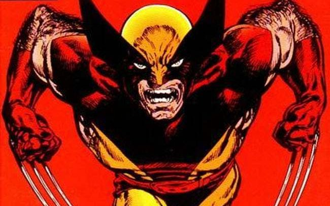
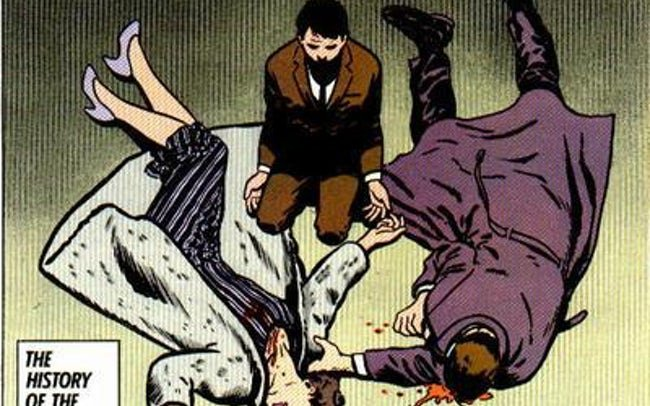

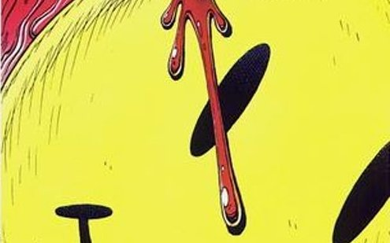

# 2. Patrí komix Marvelu alebo DC?

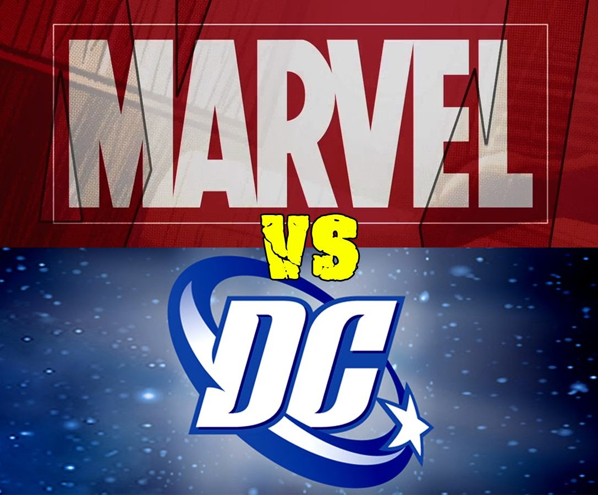

X-men, Strážcovia galaxie, Green Lantern, Fantastic Four, Aquaman, Deadool, Green Arrow, Lois Lane

# 3. Najdrahšie komixy

1. Najdrahší komix vôbec Action Comics #1 sa naposledy predal za $3,207,852. O ktorom hrdinovi je?
2. Druhú priečku ($1,100,000) získal Amazing Fantasy #15. O kom je?
3. Na tretej priečke ($1,075,000) je Detective Comics #27. Ktorý hrdina v tomto diele začal svoju kariéru?

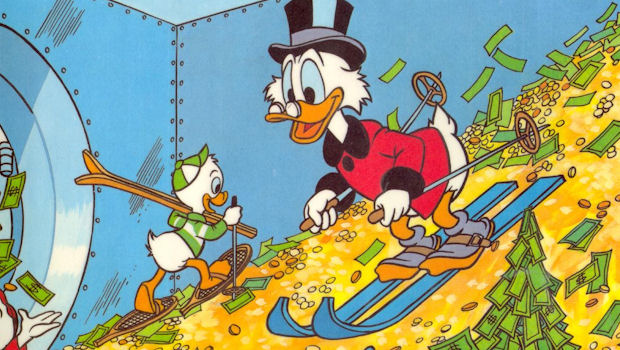

# 4. Obrázkogramy seriálov

# 5. Čo ste videli vo videu?

<video width="100%" autoplay>
  <source src="audiovideo/batman-bomb.mp4" type="video/mp4">
</video>

# 5. Čo ste videli vo videu?

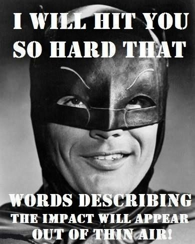

1. Akej farby bol čln, v ktorom sa bozkával párik?
2. Koľko kačičiek plávalo vo vode?
3. V akom poradi stretol Batman kapelu, mníšky a matku s kočíkom?
4. Koľkokrát vykríkol Robin "Batman"?

# 6. Ako sa volajú ženské superhrdinky

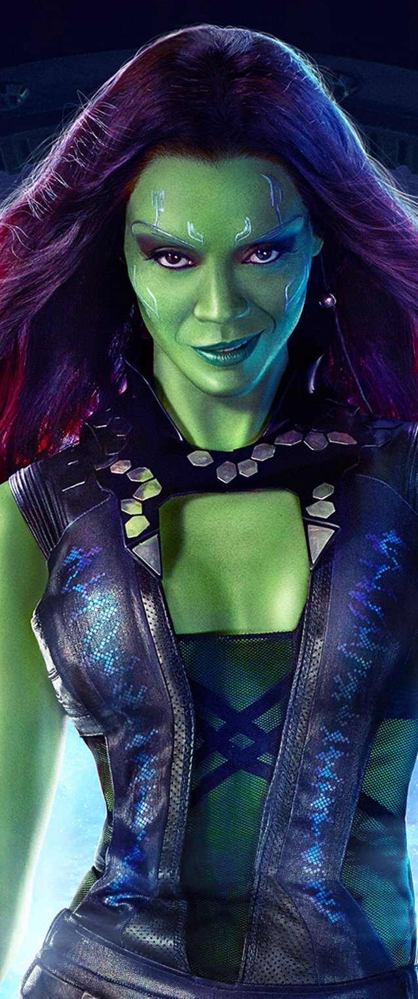

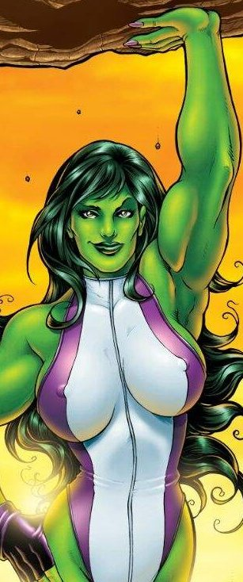

# 6. Ako sa volajú ženské superhrdinky

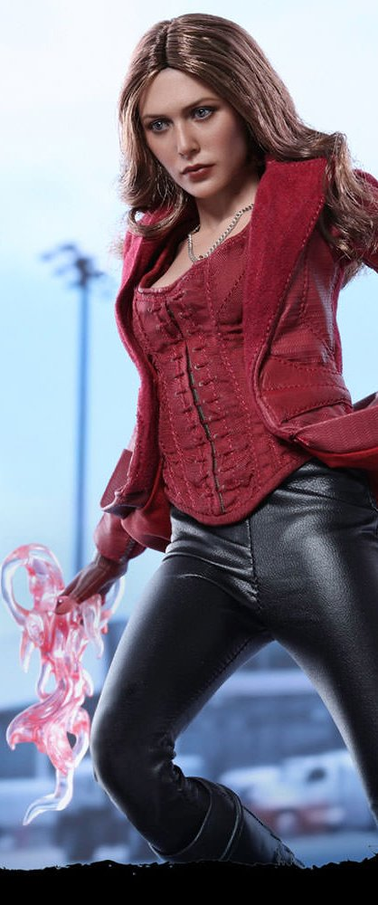

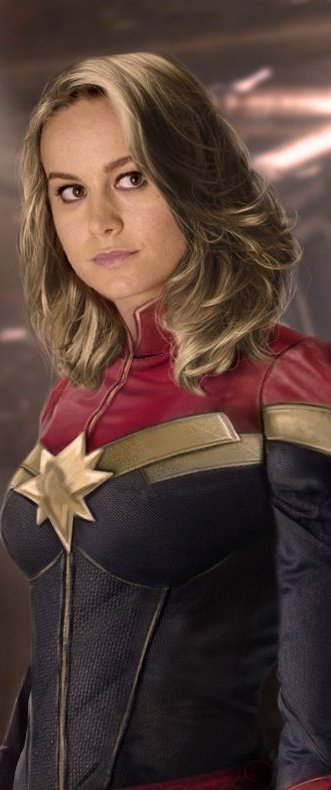

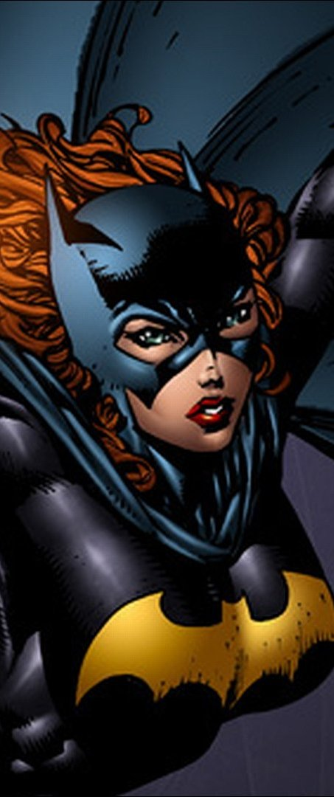

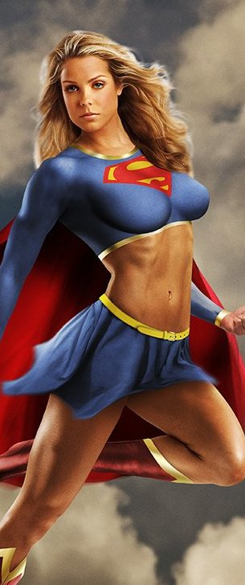

# Vesmírny Turban Quiz

## 1. kolo: Komix

### odpovede

# 1. Akému komixu patrí obálka?

 Wolverine
 Batman

 Watchmen
 Maus

# 2. Patrí komix Marvelu alebo DC?

DC: Green Lantern, Green Arrow, Lois Lane, Aquaman
Marvel: X-men, Strážcovia galaxie,  Fantastic Four, Deadool

# 3. Najdrahšie komixy

1. Najdrahší komix vôbec Action Comics #1 sa naposledy predal za $3,207,852. O ktorom hrdinovi je? O Supermanovi
2. Druhú priečku ($1,100,000) získal Amazing Fantasy #15. O kom je? O Spidermanovi
3. Na tretej priečke ($1,075,000) je Detective Comics #27. Ktorý hrdina v tomto diele začal svoju kariéru? O Batmanovi

# 4. Obrázkogramy seriálov

# 5. Čo ste videli vo videu?

1. Akej farby bol čln, v ktorom sa bozkával párik? Bielej
2. Koľko kačičiek plávalo vo vode? Päť
3. V akom poradi stretol Batman kapelu, mníšky a matku s kočíkom? Matka, kapela, mníšky
4. Koľkokrát vykríkol Robin "Batman"? 2x

# 6. Ako sa volajú ženské superhrdinky

Black Widow

Suzanne

Gamora

She-Hulk

# 6. Ako sa volajú ženské superhrdinky

Scarlet Witch

Captain Marvel

Batgirl

Supergirl

# Vesmírny Turban Quiz

## 2. kolo: Komix

# 1. Čo je to a komu to patrí?

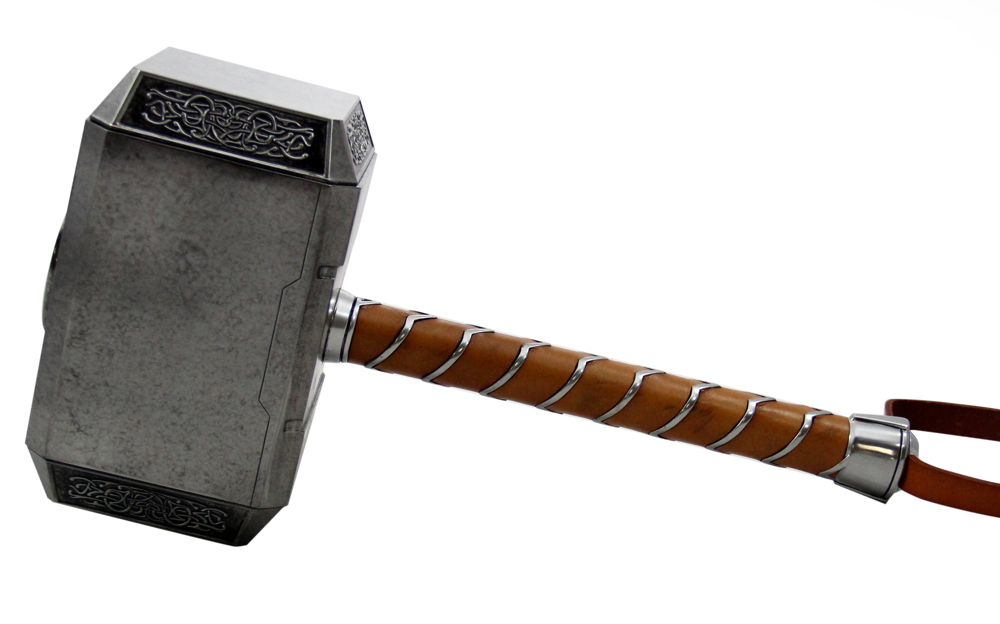
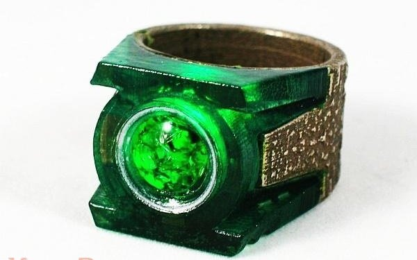

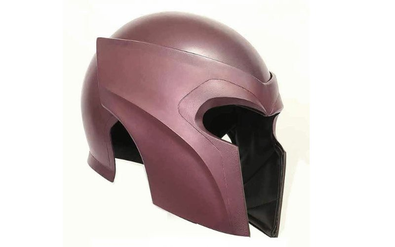
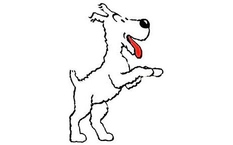

# 2. Garfield

1. Ako sa volá Garfieldov vlastník?
2. V ktorej európskej krajine sa Garfield volá Karvinen?
3. Garfield drží rekord v počte rôznych novín a magazínov, ktoré ho niekedy vytlačili. Koľko ich je? (tol. 300)

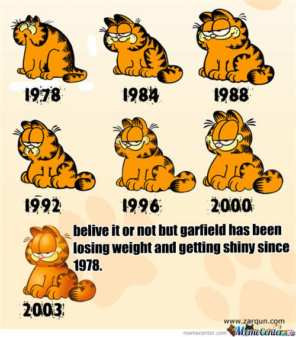

# 3. Zvučky seriálov?

<video width="100%" autoplay>
  <source src="audiovideo/komixy-zvucky.mp4" type="video/mp4">
</video>

# 3. Zvučky seriálov?

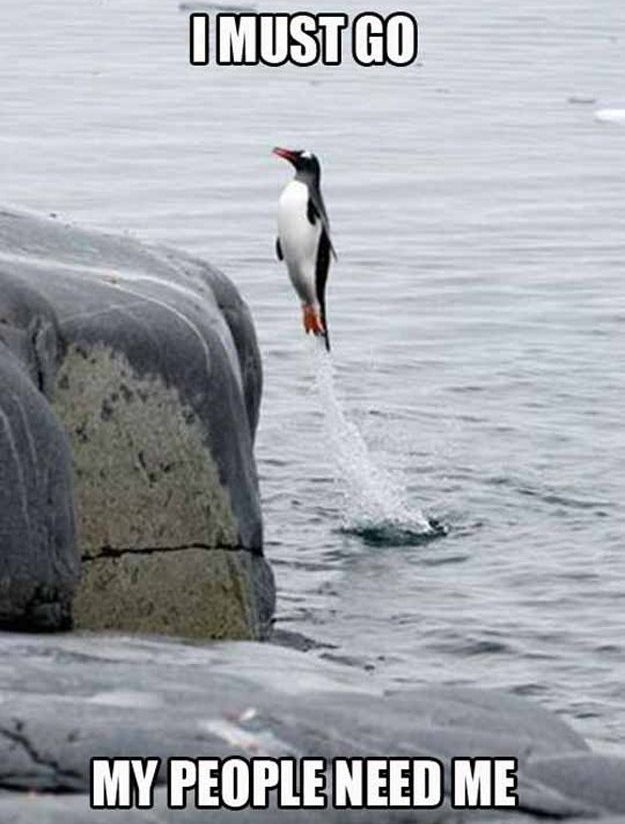

Z akého seriálu je zvučka?

# 4. Ako sa volajú tieto české komixy?

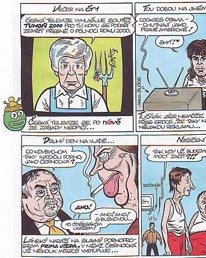

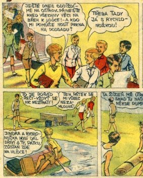

# 4. Ako sa volajú tieto české komixy?

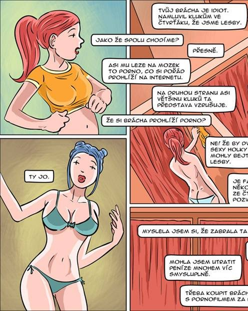

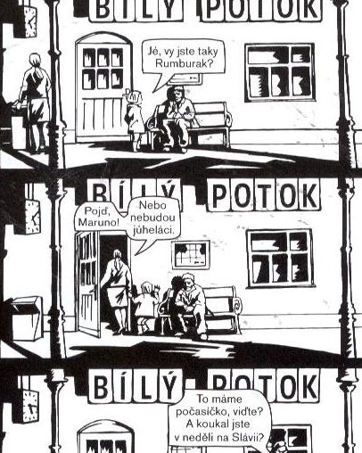

# 5. Asterix

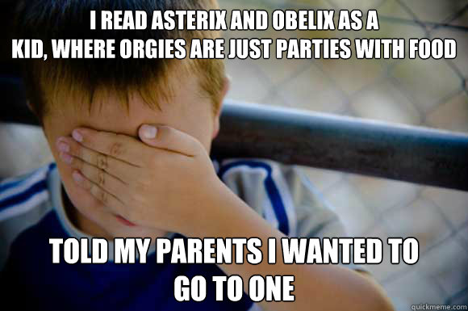

1. Na ktorej časti oblečenia mal Asterix krídelká?
2. V ktorom storočí sa odohráva komix Asterix?
3. Koľko hraných filmov o Asterixovi zatiaľ vyšlo?

# 6. Kto je to?

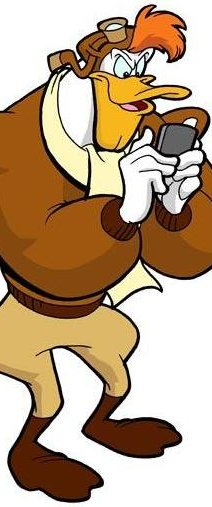

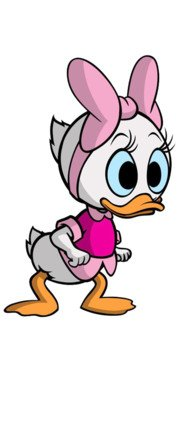

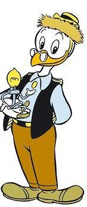

# 6. Kto je to?

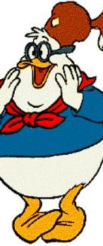
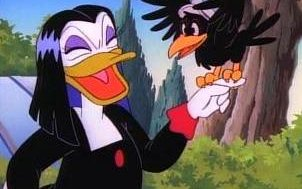

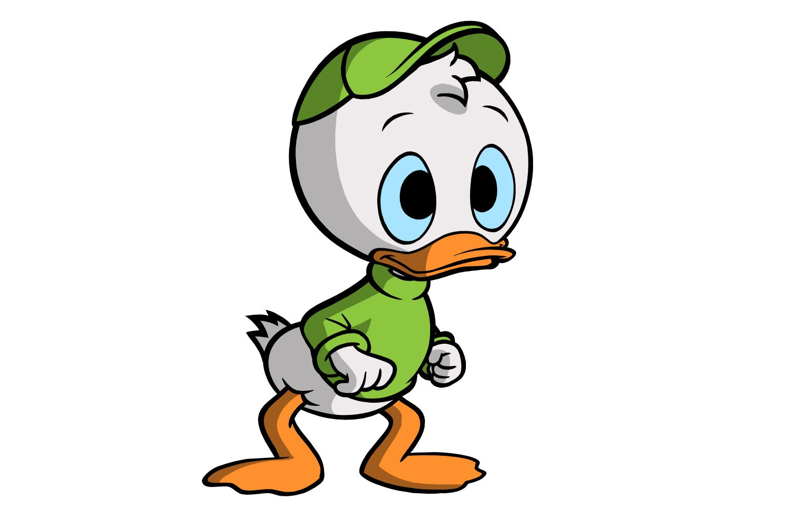
